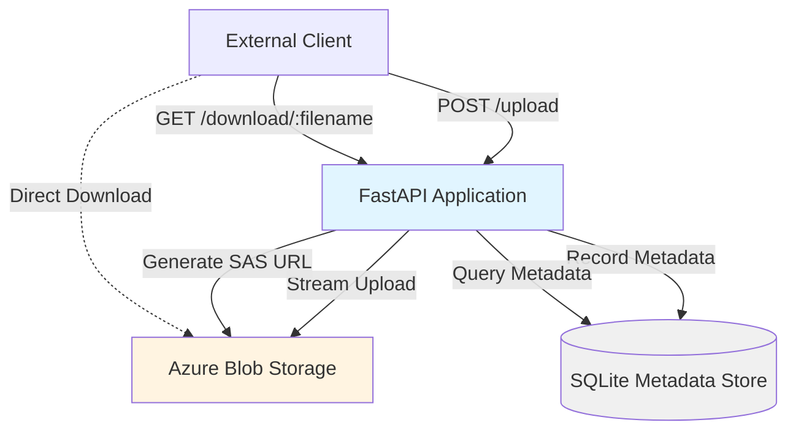

# Design Document: Cloud Storage Service

## Overview

The Cloud Storage Service is a REST API application built with FastAPI that provides secure file upload and retrieval capabilities using Azure Blob Storage as the backend. The service acts as an intermediary layer that handles file operations, generates time-limited secure access URLs (SAS URLs), and maintains metadata about stored files in a local database.

The architecture follows a three-tier pattern:
- **API Layer**: FastAPI endpoints handling HTTP requests and responses
- **Storage Layer**: Azure Blob Storage SDK client managing cloud operations
- **Persistence Layer**: SQLite database tracking file metadata

Key design principles:
- Asynchronous I/O throughout to maximize concurrency
- Streaming file uploads to minimize memory footprint
- Direct client-to-blob downloads via SAS URLs (no proxy streaming)
- Fail-fast validation before expensive cloud operations
- Comprehensive error handling with clear client feedback

## Architecture

### System Components



### Component Responsibilities

**FastAPI Application**:
- Request validation and parsing
- File size enforcement
- Orchestration of upload/download workflows
- HTTP response formatting
- Error handling and logging

**Azure Blob Storage Client** (`BlobServiceClient`):
- Connection management to Azure
- Blob upload operations (streaming)
- SAS URL generation with time-limited permissions
- Blob existence verification

**SQLite Metadata Store**:
- Persistent storage of file metadata (filename, size, timestamp)
- Filename lookup for download requests
- Audit trail of upload operations

### Request Flow

**Upload Flow**:
1. Client sends POST request with multipart file data
2. FastAPI validates file size against configured limit
3. If valid, stream file directly to Azure Blob Storage
4. On successful upload, record metadata in SQLite
5. Return HTTP 201 with upload confirmation

**Download Flow**:
1. Client sends GET request with filename parameter
2. FastAPI queries SQLite to verify filename exists
3. If found, verify blob exists in Azure
4. Generate SAS URL with 10-minute read-only access
5. Return HTTP 200 with SAS URL in JSON response
6. Client uses SAS URL to download directly from Azure

## Components and Interfaces

### API Endpoints

#### POST /upload

**Purpose**: Accept file uploads and store them in Azure Blob Storage

**Request**:
- Method: POST
- Content-Type: multipart/form-data
- Body: File field named "file"

**Response (Success - HTTP 201)**:
```json
{
  "filename": "document.pdf",
  "size": 1048576,
  "upload_timestamp": "2024-01-15T10:30:00Z"
}
```

**Response (Error - HTTP 413)**:
```json
{
  "error": "File too large"
}
```

**Response (Error - HTTP 502)**:
```json
{
  "error": "Azure service error: <details>"
}
```

**Response (Error - HTTP 504)**:
```json
{
  "error": "Azure Connection Timeout"
}
```

#### GET /download/{filename}

**Purpose**: Generate secure time-limited URL for file retrieval

**Request**:
- Method: GET
- Path Parameter: filename (string)

**Response (Success - HTTP 200)**:
```json
{
  "filename": "document.pdf",
  "sas_url": "https://<account>.blob.core.windows.net/<container>/document.pdf?<sas_token>"
}
```

**Response (Error - HTTP 404)**:
```json
{
  "error": "Blob Not Found"
}
```

### Azure Storage Client Interface

**Class**: `AzureStorageClient`

**Methods**:

```python
async def upload_blob(filename: str, file_data: BinaryIO) -> None:
    """
    Stream file data to Azure Blob Storage.
    
    Args:
        filename: Name to store the blob under
        file_data: File-like object to stream
        
    Raises:
        AzureConnectionError: On timeout or connection failure
        AzureServiceError: On Azure service errors
    """

async def generate_sas_url(filename: str, expiry_minutes: int = 10) -> str:
    """
    Generate time-limited SAS URL for blob access.
    
    Args:
        filename: Name of the blob
        expiry_minutes: URL validity duration (default 10)
        
    Returns:
        Complete SAS URL with read permissions
        
    Raises:
        BlobNotFoundError: If blob doesn't exist
        AzureServiceError: On Azure service errors
    """

async def blob_exists(filename: str) -> bool:
    """
    Check if blob exists in Azure storage.
    
    Args:
        filename: Name of the blob to check
        
    Returns:
        True if blob exists, False otherwise
    """
```

**Configuration**:
- Connection string from environment variable `AZURE_STORAGE_CONNECTION_STRING`
- Container name from environment variable `AZURE_CONTAINER_NAME`
- Timeout configuration for connection attempts

### Metadata Store Interface

**Class**: `MetadataStore`

**Methods**:

```python
async def record_upload(filename: str, size: int, timestamp: datetime) -> None:
    """
    Record successful file upload metadata.
    
    Args:
        filename: Name of uploaded file
        size: File size in bytes
        timestamp: Upload completion time
    """

async def get_metadata(filename: str) -> Optional[FileMetadata]:
    """
    Retrieve metadata for a specific file.
    
    Args:
        filename: Name of file to look up
        
    Returns:
        FileMetadata object if found, None otherwise
    """

async def initialize() -> None:
    """
    Initialize database schema if not exists.
    Creates files table with columns: filename, size, upload_timestamp
    """
```

**Storage Format**: SQLite database with schema:

```sql
CREATE TABLE IF NOT EXISTS files (
    filename TEXT PRIMARY KEY,
    size INTEGER NOT NULL,
    upload_timestamp TEXT NOT NULL
);
```

## Data Models

### FileMetadata

```python
from dataclasses import dataclass
from datetime import datetime

@dataclass
class FileMetadata:
    filename: str
    size: int
    upload_timestamp: datetime
```

### UploadResponse

```python
from pydantic import BaseModel
from datetime import datetime

class UploadResponse(BaseModel):
    filename: str
    size: int
    upload_timestamp: datetime
```

### DownloadResponse

```python
from pydantic import BaseModel

class DownloadResponse(BaseModel):
    filename: str
    sas_url: str
```

### ErrorResponse

```python
from pydantic import BaseModel

class ErrorResponse(BaseModel):
    error: str
```

### Configuration

```python
from pydantic_settings import BaseSettings

class Settings(BaseSettings):
    azure_storage_connection_string: str
    azure_container_name: str
    max_file_size_mb: int = 100
    sas_url_expiry_minutes: int = 10
    database_path: str = "metadata.db"
    
    class Config:
        env_file = ".env"
```


## Correctness Properties

*A property is a characteristic or behavior that should hold true across all valid executions of a system—essentially, a formal statement about what the system should do. Properties serve as the bridge between human-readable specifications and machine-verifiable correctness guarantees.*

### Property 1: Upload Endpoint Accepts Multipart Form Data

*For any* valid file data submitted as multipart/form-data to the upload endpoint, the service should accept and process the request without rejecting based on content type.

**Validates: Requirements 1.1**

### Property 2: Successful Upload Response Structure

*For any* file successfully uploaded, the HTTP 201 response should contain a JSON object with fields for filename (matching the uploaded file), size (in bytes), and upload_timestamp (ISO 8601 format).

**Validates: Requirements 1.3, 10.3**

### Property 3: Filename Preservation

*For any* file uploaded with a given filename, retrieving the blob from Azure should return a blob with the exact same filename.

**Validates: Requirements 1.5**

### Property 4: File Size Limit Enforcement

*For any* file exceeding the configured maximum file size, the upload request should be rejected with HTTP 413 and error message "File too large".

**Validates: Requirements 2.2**

### Property 5: Download Endpoint Accepts Filename Parameter

*For any* filename provided as a path parameter to the download endpoint, the service should process the request and return either a success response with SAS URL or an appropriate error response.

**Validates: Requirements 3.1**

### Property 6: SAS URL Expiry and Permissions

*For any* valid file download request, the generated SAS URL should have read-only permissions and be valid for exactly 10 minutes from generation time.

**Validates: Requirements 3.2**

### Property 7: Successful Download Response Structure

*For any* successful download request, the HTTP 200 response should contain a JSON object with fields for filename and sas_url (a valid Azure Blob Storage URL with SAS token).

**Validates: Requirements 3.3, 10.4**

### Property 8: No Server-Side File Streaming

*For any* download request, the response should contain only a URL reference (SAS URL) and not the actual file content, ensuring the client downloads directly from Azure.

**Validates: Requirements 3.4**

### Property 9: SAS URL Read-Only Access

*For any* generated SAS URL, attempting to use it for write or delete operations should fail, while read operations should succeed.

**Validates: Requirements 3.5**

### Property 10: Metadata Recording on Upload

*For any* successfully uploaded file, the metadata store should contain a record with the exact filename, file size in bytes, and upload timestamp.

**Validates: Requirements 4.1**

### Property 11: Non-Existent File Returns 404

*For any* filename that does not exist in the metadata store, a download request should return HTTP 404 with error message "Blob Not Found".

**Validates: Requirements 6.1**

### Property 12: Concurrent Request Handling

*For any* set of concurrent upload and download requests, all requests should complete successfully without blocking or timing out, demonstrating non-blocking asynchronous behavior.

**Validates: Requirements 9.3**

### Property 13: Success Responses in JSON Format

*For any* successful API request (upload or download), the response should be valid JSON with appropriate content-type header.

**Validates: Requirements 10.1**

### Property 14: Error Responses in JSON Format with Error Field

*For any* failed API request, the response should be valid JSON containing an "error" field with a descriptive error message.

**Validates: Requirements 10.2**

## Error Handling

### Error Categories and HTTP Status Codes

The service implements comprehensive error handling with specific HTTP status codes for different failure scenarios:

**Client Errors (4xx)**:
- **413 Payload Too Large**: File exceeds configured maximum size limit
  - Triggered before Azure upload attempt
  - Returns: `{"error": "File too large"}`
  
- **404 Not Found**: Requested file does not exist
  - Checked in both metadata store and Azure Blob Storage
  - Returns: `{"error": "Blob Not Found"}`

**Server Errors (5xx)**:
- **502 Bad Gateway**: Azure Blob Storage service error
  - Azure returns error response (authentication failure, service unavailable, etc.)
  - Returns: `{"error": "Azure service error: <details>"}`
  
- **504 Gateway Timeout**: Azure connection timeout
  - Azure client cannot establish connection within timeout period
  - Returns: `{"error": "Azure Connection Timeout"}`

### Error Handling Strategy

**Validation Errors**:
- File size validation occurs before streaming to Azure
- Metadata lookup occurs before SAS URL generation
- Fail-fast approach minimizes wasted resources

**Azure Client Errors**:
- All Azure SDK exceptions are caught and mapped to appropriate HTTP status codes
- Exception types:
  - `ResourceNotFoundError` → HTTP 404
  - `ServiceRequestError` (timeout) → HTTP 504
  - `HttpResponseError` → HTTP 502
  - Generic exceptions → HTTP 500

**Logging**:
- All Azure connection errors logged with timestamp and full error details
- Upload and download operations logged for audit trail
- Error logs include request context (filename, operation type)

**Graceful Degradation**:
- If metadata store is unavailable, service returns HTTP 500
- If Azure is unreachable, service returns appropriate 5xx error
- No silent failures - all errors result in clear client feedback

### Error Recovery

**Transient Failures**:
- Azure SDK includes built-in retry logic for transient network errors
- Timeout configuration allows reasonable wait time before failing

**Consistency Issues**:
- If file exists in metadata but not in Azure: return 404 (treat as not found)
- If file exists in Azure but not in metadata: not accessible via API (metadata is source of truth)

## Testing Strategy

### Dual Testing Approach

The testing strategy employs both unit tests and property-based tests to ensure comprehensive coverage:

**Unit Tests**: Focus on specific examples, edge cases, and integration points
- Specific file upload scenarios (empty files, special characters in filenames)
- Error condition examples (Azure timeout, missing environment variables)
- Configuration validation (startup with missing env vars)
- Docker container build and startup
- Metadata persistence across restarts

**Property-Based Tests**: Verify universal properties across randomized inputs
- Generate random file data, filenames, and sizes
- Test properties hold for all valid inputs
- Minimum 100 iterations per property test
- Each test references its design document property

### Property-Based Testing Configuration

**Framework**: Hypothesis (Python property-based testing library)

**Test Configuration**:
```python
from hypothesis import given, settings
import hypothesis.strategies as st

@settings(max_examples=100)
@given(
    filename=st.text(min_size=1, max_size=255),
    file_data=st.binary(min_size=1, max_size=1024*1024)
)
async def test_property_X(filename, file_data):
    """
    Feature: cloud-storage-service, Property X: <property text>
    """
    # Test implementation
```

**Test Tagging**: Each property test includes a docstring comment:
```
Feature: cloud-storage-service, Property {number}: {property_text}
```

### Test Coverage Areas

**Unit Test Focus**:
- Example: Upload a 5MB PDF file, verify HTTP 201 response
- Example: Request download for "test.txt", verify SAS URL format
- Example: Upload file exceeding 100MB limit, verify HTTP 413
- Example: Start service without AZURE_STORAGE_CONNECTION_STRING, verify startup failure
- Example: Upload file, restart service, verify metadata persists
- Edge case: Upload file with Unicode characters in filename
- Edge case: Request download for filename with special characters
- Integration: Full upload-download cycle with actual Azure storage (integration test)

**Property Test Focus**:
- Property 1: Random files with multipart/form-data accepted
- Property 2: All successful uploads return correct JSON structure
- Property 3: All uploaded filenames preserved in Azure
- Property 4: All oversized files rejected with HTTP 413
- Property 5: All download requests processed (success or error)
- Property 6: All SAS URLs have 10-minute expiry and read-only permissions
- Property 7: All successful downloads return correct JSON structure
- Property 8: All download responses contain URLs, not file content
- Property 9: All SAS URLs allow read but deny write/delete
- Property 10: All successful uploads recorded in metadata
- Property 11: All non-existent files return HTTP 404
- Property 12: Concurrent requests complete without blocking
- Property 13: All success responses are valid JSON
- Property 14: All error responses are valid JSON with error field

### Testing Tools

**Frameworks**:
- pytest: Test runner and assertion framework
- pytest-asyncio: Async test support
- Hypothesis: Property-based testing
- httpx: Async HTTP client for API testing

**Mocking**:
- pytest-mock: Mock Azure SDK for unit tests
- Responses library: Mock HTTP responses

**Integration Testing**:
- Azurite: Local Azure Blob Storage emulator for integration tests
- Docker Compose: Orchestrate service and Azurite for integration tests

### Test Execution

**Local Development**:
```bash
# Run all tests
pytest

# Run only unit tests
pytest -m unit

# Run only property tests
pytest -m property

# Run with coverage
pytest --cov=app --cov-report=html
```

**CI/CD Pipeline**:
- Run unit tests on every commit
- Run property tests on every pull request
- Run integration tests before deployment
- Enforce minimum 80% code coverage

### Example Test Cases

**Unit Test Example**:
```python
async def test_upload_file_success():
    """Test successful file upload returns HTTP 201 with metadata"""
    client = TestClient(app)
    file_data = b"test content"
    files = {"file": ("test.txt", file_data, "text/plain")}
    
    response = client.post("/upload", files=files)
    
    assert response.status_code == 201
    assert response.json()["filename"] == "test.txt"
    assert response.json()["size"] == len(file_data)
    assert "upload_timestamp" in response.json()
```

**Property Test Example**:
```python
@settings(max_examples=100)
@given(
    filename=st.text(min_size=1, max_size=255, alphabet=st.characters(blacklist_categories=('Cs',))),
    file_size=st.integers(min_value=1, max_value=50*1024*1024)
)
async def test_property_filename_preservation(filename, file_size):
    """
    Feature: cloud-storage-service, Property 3: For any file uploaded with a given filename, 
    retrieving the blob from Azure should return a blob with the exact same filename.
    """
    file_data = b"x" * file_size
    
    # Upload file
    upload_response = await upload_file(filename, file_data)
    assert upload_response.status_code == 201
    
    # Verify blob exists with same filename
    blob_exists = await azure_client.blob_exists(filename)
    assert blob_exists
    
    # Verify blob name matches
    blob_properties = await azure_client.get_blob_properties(filename)
    assert blob_properties.name == filename
```
